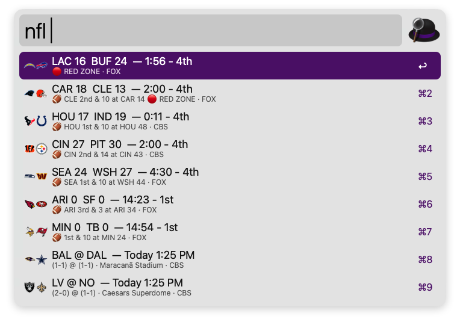
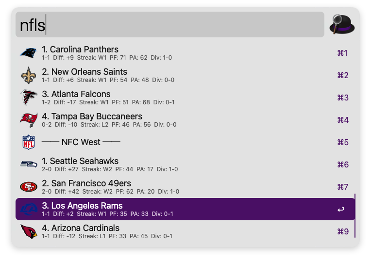
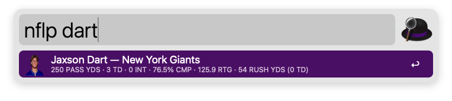
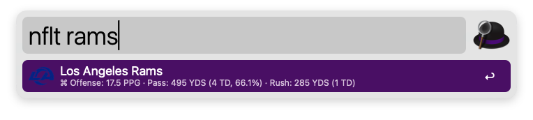

# 🏈 NFL Scores — Alfred Workflow

Live scores, division standings, player stats, and team statistics right in your macOS Alfred launcher.


---

## 📸 Previews

### Live & Weekly Scores (`nfl`)
Real-time game clock, quarter, down & distance, red zone alerts, dual team matchup logos, and TV networks.
<p align="center">
  
</p>

### Division Standings (`nfls`)
Hierarchical standings for all 8 NFL divisions across the AFC and NFC.
<p align="center">
  
</p>

### Player Statistics & Headshots (`nflp {name}`)
Live player headshots cached from ESPN CDN with position-tailored stats (QB, RB, WR, TE, K, DEF).
<p align="center">
  
</p>

### Team Hub & Modifiers (`nflt {query}`)
Season records and split offensive (`⌘`) & defensive (`⌥`) statistical previews.
<p align="center">
  
</p>

---

## ⚡ Features

- **🏈 Live Game Tracking**:
  - Live game clock, quarter, down & distance (`2nd & 5 at KC 28`).
  - Red zone indicator (🔴 `RED ZONE`).
  - Dynamic dual team matchup icons (side-by-side logos rendered on the fly in pure Python).
  - TV broadcast channel detection (FOX, CBS, NBC, ESPN, ABC).
  - Auto-refreshes every 5 seconds while games are live.
- **📊 Division Standings**:
  - All 8 NFL divisions grouped across AFC & NFC (`nfls`).
  - Visual division headers with W-L records, point differential, streak, PF, and PA.
- **🏃‍♂️ Player Statistics Search**:
  - Real-time player headshots downloaded from ESPN's CDN and cached locally in Alfred's cache (`nflp {name}`).
  - Positional stat formatting for QBs, RBs, WRs, TEs, Kickers, and Defense.
- **🛡️ Team Hub**:
  - Browse or search all 32 NFL franchises (`nflt {query}`).
  - Hold `⌘` (Cmd) for offensive stats (Points Per Game, Passing YDS, Rushing YDS).
  - Hold `⌥` (Alt) for defensive stats (Sacks, Interceptions, Forced Fumbles, Tackles).
- **🔋 Zero Dependencies**:
  - Pre-bundled lightweight HTTP runtime.
  - Custom pure-Python PNG chunk encoder/decoder so no third-party libraries (like Pillow) are needed at runtime.
  - Automatically converts UTC timestamps to your Mac's local system timezone.

---

## 🚀 Installation

1. Download the latest **`NFL.Scores.alfredworkflow`** from the [Releases](https://github.com/PopBot/alfred-nfl-scores/releases) page.
2. Double-click the downloaded file to install it into Alfred 5.
3. Type `nfl` into Alfred!

---

## ⌨️ Usage

| Keyword | Action |
|---|---|
| `nfl` | Current week's scores (Live $\rightarrow$ Upcoming $\rightarrow$ Final) |
| `nfls` | Standings grouped by all 8 NFL divisions |
| `nflp {name}` | Player search & stats (e.g. `nflp mahomes`, `nflp henry`) |
| `nflt {query}` | Team search & stats (e.g. `nflt chiefs`, `nflt 49ers`) |

### Action Modifiers
- **Scores (`nfl`)**:
  - `Enter`: Open Gamecast
  - `⌘ Enter`: Open Game Box Score
  - `⌥ Enter`: Open Play-by-Play
- **Team Stats (`nflt`)**:
  - `Enter`: Open Team Clubhouse
  - `⌘`: View Offensive stats preview / open stats page
  - `⌥`: View Defensive stats preview / open stats page
- **Player Stats (`nflp`)**:
  - `Enter`: Open ESPN Player Card
  - `⌘ Enter`: Open Player Game Log
  - `⌥ Enter`: Open Player Split Stats

---

## 🛠️ Building from Source

```bash
git clone https://github.com/PopBot/alfred-nfl-scores.git
cd alfred-nfl-scores

# Download all 32 team logos and package into .alfredworkflow
python3 build.py
```

The resulting `NFL Scores.alfredworkflow` will be created in the repository root directory.

---

## 📄 License
MIT License. Data provided via ESPN's public endpoints.
